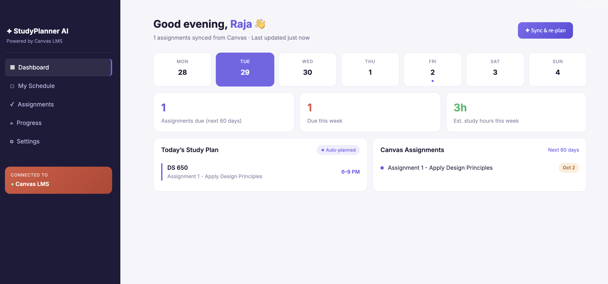
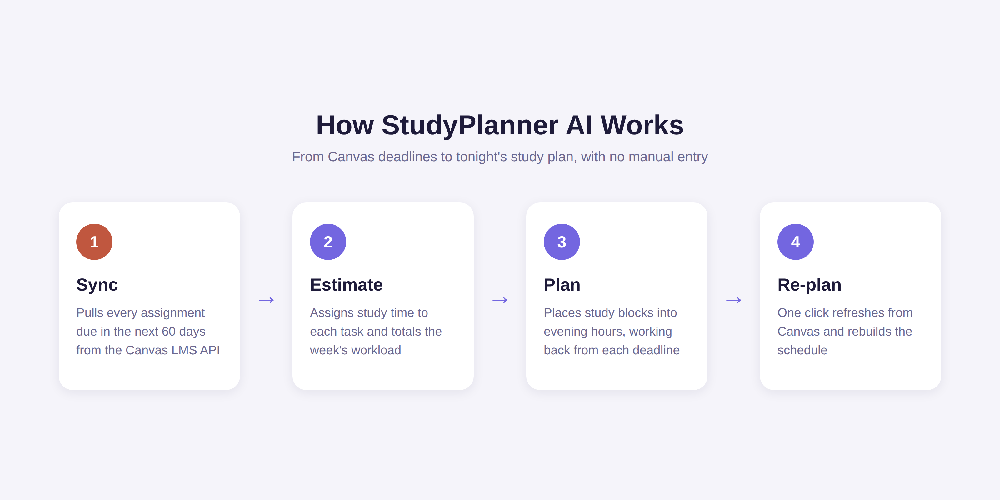

# StudyPlanner AI

A Streamlit dashboard that syncs assignments straight from **Canvas LMS**, auto-plans a daily study schedule, and estimates study hours for the week ahead.



## Why I built it

Canvas tells you what's due, but not when to work on it. As a full-time AI Engineer finishing my MS at NJIT, my evenings are my only study time, so I built a planner that reads Canvas and tells me what to study tonight, with zero manual entry.

## Features

- **Live Canvas sync:** pulls every assignment due in the next 60 days across all active courses
- **Weekly strip:** highlights today and marks days with deadlines
- **Quick stats:** assignments due in 60 days, due this week, and estimated study hours
- **Today's Study Plan:** auto-planned time blocks, soonest deadline first, skipping lunch
- **Canvas Assignments panel:** color-coded by course, with due-date badges that link back to Canvas
- **Sync & re-plan:** one click refreshes from Canvas and rebuilds the plan
- All times shown in Eastern time

## How it works



1. **Sync:** `fetch_assignments.py` calls the Canvas REST API (with pagination) for active courses and their future assignments.
2. **Estimate:** each assignment gets a study-time estimate based on its point value.
3. **Plan:** study blocks are placed into the next free hours of the day, soonest deadline first.
4. **Re-plan:** data is cached for 15 minutes; the Sync button clears the cache and rebuilds.

## Tech stack

Python · Streamlit · Canvas LMS REST API · requests · python-dotenv

## Run it locally

```bash
git clone https://github.com/manudhannayak/study-planner-ai.git
cd study-planner-ai
pip install -r requirements.txt
cp .env.example .env   # then add your Canvas token and domain
streamlit run app.py
```

To get a Canvas token: Canvas → Account → Settings → **New Access Token**. Keep it in `.env`; it is git-ignored and never committed.

You can also run `python fetch_assignments.py` on its own to print upcoming assignments and save them to `assignments.json`.

## Roadmap

- Deadline reminders
- Full calendar view
- Progress tracking that adapts the plan when you fall behind
- Custom study hours per day

## Write-up

Read the full project write-up on Medium: [AI-Powered Study Planner with Canvas LMS Integration](https://medium.com/@rajamanaswinidhannayak)

---

Built by **Rajamanaswini Dhannayak**, AI Engineer
